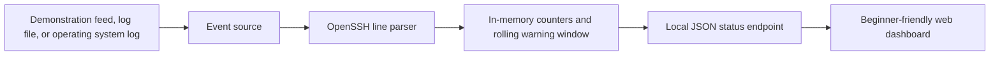

# SSH Monitor

SSH Monitor turns technical OpenSSH sign-in records into a small dashboard that can be understood without prior SSH experience. It shows accepted sign-ins, rejected sign-ins, repeated failures, and the network addresses responsible for those attempts.

The project runs in a safe demonstration mode by default. No SSH server, system log access, account, or password is required to explore it.

## What SSH means

SSH stands for Secure Shell. It is a common way to open a command line on another computer over a network. A person usually signs in with a password or a cryptographic key.

An SSH server records each sign-in attempt:

- A successful attempt means that the server accepted the supplied credentials.
- A failed attempt can be a typing mistake or an unauthorized attempt.
- Many failures from the same source in a short period can indicate automated password guessing, which is often called a brute-force attack.

SSH Monitor reads those records and explains the activity. It does not change accounts, block addresses, or modify firewall rules.

## Quick start with Docker

Docker provides the same startup process on macOS, Windows, and Linux.

### Requirements

- Docker Desktop on macOS or Windows, or Docker Engine on Linux
- Docker Compose version 2, included with current Docker installations

### Start the project

From the project directory, run:

```console
docker compose up --build
```

Open [http://localhost:8080](http://localhost:8080) in a browser. Demonstration events will begin appearing automatically. The example addresses belong to ranges reserved for documentation and do not represent real computers.

Press `Ctrl+C` in the terminal to stop the project. If it was started in the background, stop it with:

```console
docker compose down
```

The complete default installation contains one application service. There are no dashboard credentials and no external database to configure.

## Quick start without Docker

The application uses only the Python standard library. Python 3.9 or newer is required.

On macOS or Linux:

```console
python3 -m ssh_monitor
```

On Windows:

```console
py -m ssh_monitor
```

Then open [http://localhost:8080](http://localhost:8080). The default source is demonstration data in both cases.

## Understanding the dashboard

The dashboard updates every two seconds and contains the following sections:

| Section | Meaning |
| --- | --- |
| Current status | States whether recent failed attempts have reached the warning threshold. |
| Failed in the current window | Failed sign-ins during the rolling time period, which is 60 seconds by default. |
| Failed since startup | Every failed sign-in observed since the application started. |
| Successful since startup | Every accepted sign-in observed since the application started. |
| Most failed sources | Network addresses with the most rejected attempts during this session. |
| Recent sign-in activity | The newest parsed events, including outcome, username, address, and time. |

The warning is informational. Investigate the affected machine before taking action because legitimate users can also produce failed sign-ins.

## Monitoring real SSH activity

There are two ways to read real activity:

1. Native system mode asks the local operating system for its SSH records. This is the simplest option when Python is available.
2. File mode follows a specified text log. It works both natively and in Docker.

System logs can contain usernames and network addresses. Run the monitor only on a computer you are authorized to inspect, and do not expose the dashboard to an untrusted network.

### Linux native system mode

The monitor looks for `/var/log/auth.log`, used by Debian and Ubuntu, and then `/var/log/secure`, used by distributions such as Red Hat and Fedora.

```console
python3 -m ssh_monitor --source system
```

If the terminal reports a permission error, run it from an account that can read the authentication log. On many systems this requires membership in the appropriate system logging group or an administrator-approved use of `sudo`.

### macOS native system mode

Modern macOS releases store SSH activity in the unified system log. The monitor uses the built-in `log stream` command:

```console
python3 -m ssh_monitor --source system
```

macOS may request additional terminal permissions. If the dashboard reports that the source stopped or cannot be read, grant the terminal access in System Settings and restart the command.

### Windows native system mode

Windows OpenSSH writes to the `OpenSSH/Operational` event log. Open PowerShell and run:

```powershell
py -m ssh_monitor --source system
```

The Windows OpenSSH Server feature must be installed and its `sshd` service must be running. An administrator PowerShell session may be required to read the event log. The application reports a clear data source error on the dashboard if the event log is unavailable.

### Follow a specific file natively

Use file mode when OpenSSH writes to a custom location or when you have an exported log:

```console
python3 -m ssh_monitor --source file --log-file /path/to/ssh.log
```

Use `py` instead of `python3` on Windows. Existing records are read at startup. Add `--ignore-existing` to process only records appended after startup.

### Follow a specific file with Docker

Copy the example environment file to `.env`:

On macOS or Linux:

```console
cp .env.example .env
```

On Windows PowerShell:

```powershell
Copy-Item .env.example .env
```

Edit these two values in `.env`:

```dotenv
SSH_MONITOR_SOURCE=file
SSH_MONITOR_LOG_PATH=/var/log/auth.log
```

Use a path that exists on the host. Examples include `/var/log/secure` on some Linux distributions and `C:/ProgramData/ssh/logs/sshd.log` when Windows OpenSSH has been configured for file logging. Then run:

```console
docker compose up --build
```

Docker Desktop must be allowed to share the selected path. Native system mode is preferable on macOS because the unified log is not a normal text file, and on Windows when OpenSSH writes to Event Viewer.

## Configuration reference

Command-line options take precedence over environment variables when both are provided.

| Command-line option | Environment variable | Default | Purpose |
| --- | --- | --- | --- |
| `--source` | `SSH_MONITOR_SOURCE` | `demo` | Selects `demo`, `file`, or `system`. |
| `--log-file` | `SSH_MONITOR_LOG_FILE` | None | Selects the text file used by file mode. |
| `--host` | `SSH_MONITOR_HOST` | `127.0.0.1` | Selects the dashboard listening address. |
| `--port` | `SSH_MONITOR_PORT` | `8080` | Selects the dashboard port. |
| `--alert-threshold` | `SSH_MONITOR_ALERT_THRESHOLD` | `10` | Sets the number of recent failures that produces a warning. |
| `--window-seconds` | `SSH_MONITOR_WINDOW_SECONDS` | `60` | Sets the rolling period used for the warning. |
| `--poll-interval` | `SSH_MONITOR_POLL_INTERVAL` | `0.5` | Sets how often a followed file is checked for changes. |
| `--ignore-existing`, `--no-ignore-existing` | `SSH_MONITOR_IGNORE_EXISTING` | `false` | Controls whether records already present are ignored when file monitoring starts. |

See every command-line option with:

```console
python3 -m ssh_monitor --help
```

## How the application works



The event source produces text lines or demonstration events. The parser recognizes common failed-password, invalid-user, PAM failure, accepted-password, and accepted-public-key messages. The state store keeps session totals and timestamps for the rolling warning window. A small HTTP server provides the dashboard and current state.

All state is kept in memory. Restarting the application resets its totals. This keeps the installation predictable and avoids creating a database containing security log data.

## HTTP endpoints

| Endpoint | Purpose |
| --- | --- |
| `/` | Human-readable dashboard. |
| `/api/status` | Current state as JSON for local integrations. |
| `/health` | Application and data-source health summary. |

The server listens only on `127.0.0.1` during native use by default. The Docker configuration publishes port 8080 so the host browser can reach the container. Do not publish it to the internet without adding authentication and transport encryption.

## Supported OpenSSH messages

The parser recognizes common messages with these forms:

```text
Failed password for root from 203.0.113.18 port 52210 ssh2
Invalid user guest from 198.51.100.42 port 60100
Accepted publickey for deploy from 192.0.2.77 port 41120 ssh2
```

IPv4 and IPv6 source addresses are accepted. Unrelated lines and malformed addresses are ignored. OpenSSH wording can vary between platforms and versions; add a focused parser test before extending a pattern.

## Project structure

```text
.
|-- ssh_monitor/
|   |-- __main__.py        Command-line startup and lifecycle
|   |-- models.py          Parsed event data model
|   |-- parser.py          OpenSSH message recognition
|   |-- server.py          Local HTTP server
|   |-- sources.py         Demo, file, macOS, Linux, and Windows sources
|   |-- state.py           Counters and warning calculations
|   `-- web/index.html     Dashboard interface
|-- tests/                 Standard-library automated tests
|-- AGENTS.md              Development rules for future changes
|-- Dockerfile             Cross-platform application image
|-- docker-compose.yml     One-command Docker startup
`-- pyproject.toml         Python package metadata
```

## Development

No application dependencies need to be installed. Run the automated tests from the project root:

```console
python3 -m unittest discover -s tests -v
```

Check that every Python file compiles:

```console
python3 -m compileall -q ssh_monitor tests
```

Run the application and inspect the JSON endpoint when changing collection or state behavior:

```console
python3 -m ssh_monitor --alert-threshold 3
```

```console
curl http://localhost:8080/api/status
```

Future work must follow [AGENTS.md](AGENTS.md), including its plain-language, portability, testing, and formal-comment requirements.

## Troubleshooting

### Port 8080 is already in use

Choose a different native port:

```console
python3 -m ssh_monitor --port 8081
```

For Docker, set `SSH_MONITOR_PUBLIC_PORT=8081` in `.env`, restart Compose, and open `http://localhost:8081`.

### The page loads but shows no real events

Confirm the source shown at the bottom of the page. Then verify that SSH server activity is reaching that source. A client application making outbound SSH connections does not create server authentication records on the local computer.

For file mode, confirm that the file exists, contains OpenSSH messages, and is readable by the application. Source errors appear above the dashboard summary.

### Docker reports that a mount source does not exist

Set `SSH_MONITOR_LOG_PATH` to an existing file. Use forward slashes in Windows paths inside `.env`. Return `SSH_MONITOR_SOURCE` to `demo` and `SSH_MONITOR_LOG_PATH` to `./data/ssh.log` when real log access is not needed.

### The warning remains after attempts stop

The warning uses a rolling time window. It clears after the failed events become older than `SSH_MONITOR_WINDOW_SECONDS`, which is 60 seconds by default. Session totals remain visible until restart.

## Security and scope

This project is an educational local monitor, not an intrusion-prevention system. It does not verify whether an address is malicious, persist evidence, send notifications, block traffic, or replace a security information and event management platform. Production use would require authentication, encrypted transport, durable audit storage, rate limiting, privacy review, and platform-specific operational controls.

## Platform references

- [Apple: Viewing Log Messages](https://developer.apple.com/documentation/os/viewing-log-messages) explains why modern macOS logs must be read with the system logging tools rather than as ordinary text files.
- [Microsoft: OpenSSH Server Configuration for Windows](https://learn.microsoft.com/en-us/windows-server/administration/openssh/openssh-server-configuration) documents the default Windows event logging behavior and the optional file logging location.

## License

This project is available under the MIT License. See [LICENSE](LICENSE).
